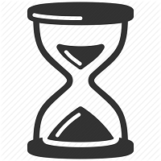
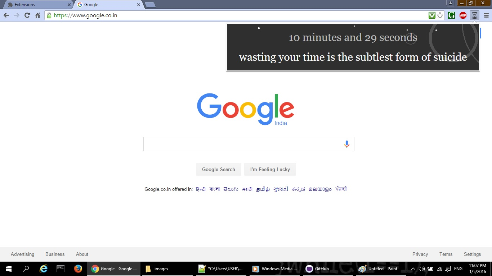

Timex
=============

Timex is a Chrome extension that keeps track of the surfing time and display it along with random quote about importance of time, whenever accessed.

[Direct download of crx file] (https://github.com/Akash1684/Timex/blob/master/Timex.crx?raw=true)

How it Works
---

* As the extension will be installed, `timer.js` will start running in the background.
* `timer.js` will calculate the active time of the *Chrome* browser.
* On accessing the extension, `main.js` will execute and time calculated by `timer.js` along with a *random quote* will be displayed.

Screenshot
---

Above is the screenshot, displaying time spent on web since the installation of the extension.

Prerequisite
---

* **Chrome** browser (Download from [here](https://www.google.co.in/chrome/browser/desktop/))

Installation
------------

In Chrome, choose Window > Extensions.  Drag Timex.crx into the page that appears.
